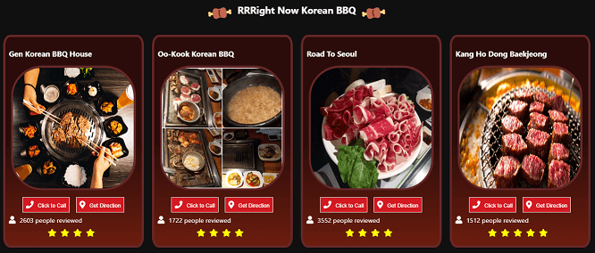

# :poultry_leg: Right Now K bbq :meat_on_bone:
> find Korean BBQ restaurants open now around you!

This web app uses web geolocation api to track and show a list of Korean BBQ restaurants nearby. If you feel hungry, then try it out right now! Turn on your locaiton service, then you are good to go. I built this app for myself. My friends and I always have a hard & long time to decide where to go. Since we all crave for Korean BBQ, so we needed a simple list of restaurants that is opening right now and must be nearby. I think this web app can solve our problem. 

(I guess I'm so lazy to filter out all the categories on Yelp. :laughing:)

* [Right Now Kbbq](https://april9288.github.io/rightnowkbbq/) - It's deployed here!



## Getting Started

### Prerequisites

If you don't have Node.js setup on your computer, please click below link and download it first.

* [Node.js](https://nodejs.org/en/) - The official Node.js website to download

### Installing

If you already have Node.js, then follow below step.

On your terminal:

```
cd /c/<folder_path>
git https://github.com/april9288/rightnowkbbq.git
cd rightnowkbbq
npm install
npm start

```

So it will automatically run in your local server.

## Built With

* [React.js](https://reactjs.org/) - The official React.js website
* [Yelp API](https://www.yelp.com/developers/documentation/v3/business_search) - Yelp API documentation
* [Geolocation API](https://developer.mozilla.org/en-US/docs/Web/API/Geolocation/getCurrentPosition) - Web API for getting the current position of the device

## Meta

James Jongho Kim 
- [Portfolio](https://april9288.github.io/) - It's my portfolio website
- [Github](https://github.com/april9288) - This is my Github page
- [Linkedin](https://www.linkedin.com/in/jongho-kim-b05618170/) - This is my Linkedin page
- april9288@gmail.com
